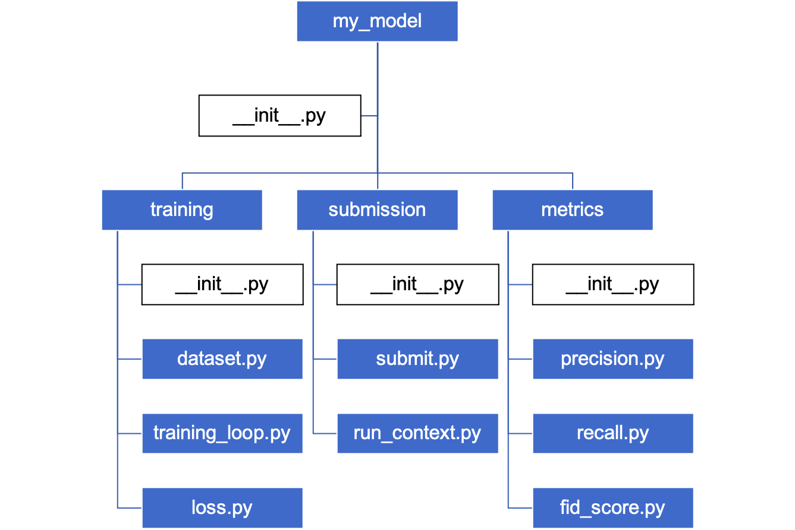

### Você deve ter ouvido e usado muitas _Bibliotecas_, _Pacotes_ e _Módulos_ em Python. Certamente você já iniciou a maioria dos seus programas importando-os.

### **Mas, o que são estes três?**

**Bibliotecas** (**Libraries**)
---
**Bibliotecas** em Python são tudo o que você obtém ao baixar e instalar a linguagem de programação Python em seu sistema. Portanto, isso significa que a biblioteca Python padrão inclui tudo, como todos os tipos de dados, as classes e os objetos.

Em outras palavras, a biblioteca padrão inclui funções, classes e objetos, tipos de dados e tudo mais que usamos ao escrever um programa.

## **Pacote (Package):**

Python é uma linguagem de programação de código aberto que oferece suporte à programação modular, o que significa que todo programador não precisa reinventar a roda. A melhor coisa sobre Python é que mesmo os maiores projetos podem ser divididos em partes menores.

Portanto, quando estamos trabalhando em um  projeto grande, seja em equipe ou sozinho, e se precisarmos de um código criado por alguém no mundo para automatizar algumas tarefas comuns, podemos usar um que foi escrito e contribuído por outra pessoa.

Os pacotes de que ouvimos falar em Python são precisamente uma parte do código que foi contribuído por alguém.

Existem milhares de pacotes Python disponíveis online. Você também pode criar o seu e contribuir com ele para a comunidade de desenvolvedores.

Existe um site onde você pode encontrar vários pacotes. Veja o link abaixo.

[Python Package Index](https://pypi.org/)

Para usar um pacote Python, precisamos instalá-lo usando o comando `pip`. A sintaxe está abaixo.

``pip install nome_do_pacote``.

> Observação: caso você esteja usando o **Google Colab**, o comando será:
>
> ``!pip install nome_do_pacote``

## **Módulo:**

Certamente você já ouviu falar sobre módulos ao aprender Python. Um módulo desempenha um papel importante em tornar o Python uma linguagem de programação modular. Assim como quando trabalhamos com eles, utilizamos código  agrupado de acordo com uma função especificamente definida.

Por exemplo, o módulo `DateTime` ajuda você a trabalhar com datas e horas.

## **Resumo #1**

Qual a diferença entre bibliotecas, pacotes e módulos em Python?

Se considerarmos a **biblioteca** Python padrão como uma biblioteca física real, então um **pacote** é como um livro nessa biblioteca e um **módulo** é como capítulos de um livro.

Então, para finalizar, podemos dizer que um pacote é uma coleção de módulos e uma biblioteca é uma coleção de pacotes.

## **Resumo #2**

Nome      | Característica
--------- | ------
**Módulo** (_Module_)      | É um arquivo `.py`, que define algumas funções, classes, variáveis, etc.
**Pacote** (_Package_)     | É uma pasta formada pela agregação de vários módulos, que pode conter vários arquivos `.py` ou pastas aninhadas.
**Biblioteca** (_Library_) | É uma coleção de códigos que completam determinadas funções. Em outras palavaras, uma coleção de pacotes.


Agora, vamos nos aprofundar em cada um desses conceitos para que possamos entender as diferenças.

# **Módulo (_Module_)**

Os módulos são essencialmente um programa com arquivos `.py`.

Outros tipos de arquivos que podem ser usados como módulos incluem `.so` , `.pyo` ,`.pyc`,
`.dll` e `.pyd`. Mas, raramente são usados na programação Python.

Vejamos alguns exemplos.

### **Observação importante**

No Google Colab, você pode usar o seguinte comando especial para salvar o conteúdo de uma célula como um arquivo Python (`.py`):

``%%writefile nome_do_arquivo.py``

Substitua "**nome_do_arquivo.py**" pelo nome desejado que você deseja criar ou atualizar.

Por exemplo, se você quiser salvar o conteúdo de uma célula como "**meu_script.py**", você pode fazer o seguinte:

``%%writefile meu_script.py``

``# Seu código Python aqui``

Depois de executar essa célula, o conteúdo dela será salvo no arquivo "**meu_script.py**" no diretório atual do seu ambiente do Google Colab.

Certifique-se de que o nome do arquivo tenha a extensão `.py` para que ele seja reconhecido como um arquivo Python.

> Observe os próximos trechos de código abaixo.

### **Criando um módulo**

*   Salve o código abaixo em um arquivo com a extensão `.py`
*   O nome do arquivo será: `meu_modulo.py`


```python
# Cria uma função
def criar():
  print("Alô Mundo")
```


```python
%%writefile meu_modulo.py
# Cria uma função
def criar():
  print("Alô Mundo")
```

### **Importando um módulo**


```python
# importa um módulo
# maneira #1
import meu_modulo

meu_modulo.criar()
```


```python
# importa um módulo
# maneira #2
from meu_modulo import criar

criar()
```

### **Variáveis no módulo**

*   Listas
*   Tuplas
*   Dicionários
*   Funções
*   Arrays
*   Objetos

> Funções e dados podem ser encapsulados também.
> Observe o código abaixo.


```python
Pessoa = {
  "nome" : "Jacky",
  "idade" : 40,
  "etnia": "Chinesa"
}
```


```python
# salvando o código acima
%%writefile meu_modulo_2.py
Pessoa = {
  "nome" : "Jacky",
  "idade" : 40,
  "etnia": "Chinesa"
}
```


```python
# Importando o módulo "meu_modulo.py" e acessando o dicionário "Pessoa"
import meu_modulo_2

x = meu_modulo_2.Pessoa["idade"]
print(x)
```

### **O apelido (_Alias_) do módulo**

Ao importar um módulo _aliases_ (apelidos) podem ser criados usando a palavra `as`:


```python
#Importa um módulo
import meu_modulo_2 as abc

x = abc.Pessoa["idade"]
print (x)
```

# **Pacote (Package)**

#### **Observações importantes**

* Usando a analogia do sistema de arquivos, o pacote pode ser definido como diretórios no sistema de arquivos.

* Módulos são arquivos dentro de diretórios.

* Em outras palavras, o pacote inclui um conjunto de módulos.

* Existem vários arquivos de módulo Python relacionados para formar um pacote completo para fácil manutenção e uso.

* O conceito do pacote pode evitar conflitos de nomenclatura de forma eficaz entre vários módulos do pacote.

* `__init__.py` pode ser o primeiro arquivo na pasta que define um pacote.
Na pasta, os arquivos de recursos, extensões e subpacotes podem ser combinados no pacote.


Por exemplo, podemos ter o seguinte pacote chamado `my_model` com módulos relacionados ao nosso projeto de Ciência de Dados, representado na figura abaixo.



> *Usa-se para importar módulos em Python o que se chama de "dot notation" ou "notação ponto"*

```python
# importar o módulo "dataset" do pacote acima
# maneira #1
import my_model.training.dataset
```

```python
# importar o módulo "dataset" do pacote acima
# maneira #2
from my_model.training import dataset
```

Suponha que dentro do módulo `dataset.py` temos uma função chamada `load_dataset()`. Para importar a função somente poderíamos fazer:

`import my_model.training.dataset.load_dataset()`

Alternativamente, poderíamos fazer assim:

`from my_model.training.dataset import load_dataset()`


# **Módulos da Biblioteca Padrão da Linguagem Python**

A Biblioteca Padrão do Python é uma coleção de módulos incluídos na linguagem.

Esses módulos fornecem uma ampla gama de funcionalidades, desde tipos de dados básicos e E/S de arquivos até recursos mais avançados, como rede e desenvolvimento web. Alguns exemplos deles são:

1. `math`: fornece funções e constantes matemáticas, incluindo funções trigonométricas e logarítmicas, bem como a constante matemática `pi`.

2. `os` e `os.path`: O módulo `os` fornece uma maneira de interagir com o sistema operacional, incluindo funções para trabalhar com arquivos e diretórios. O módulo `os.path` fornece funcionalidade adicional para trabalhar com caminhos de arquivos.

3. `sys`: fornece acesso a vários parâmetros e funções específicos do sistema, incluindo a versão do intérprete e o status de saída.

4. `JSON`: fornece funções para trabalhar com dados no formato `JSON`, incluindo codificação e decodificação.

5. `datetime`: fornece classes para trabalhar com datas e horas, incluindo as classes `date`, `time` e `datetime`.

6. `random`: fornece funções para gerar números aleatórios, incluindo a capacidade de gerar números inteiros aleatórios, flutuantes e seleções de uma lista.

7. `re`: fornece funções para trabalhar com expressões regulares, incluindo a capacidade de pesquisar e substituir texto usando expressões regulares.

8. `urllib`: fornece um conjunto de APIs simples e de alto nível para trabalhar com URLs e solicitações HTTP.

9. `zipfile` e `tarfile`: Esses módulos fornecem funções para trabalhar com arquivos do tipo `ZIP` e `TAR`, respectivamente.

10. `collections`: fornece alternativas aos tipos integrados (i.e. _built-in_) do Python que podem ser mais eficientes em determinados casos. Inclui alternativas como `OrderedDict`, `defaultdict` e `Counter`.


# **Biblioteca (Library)**

Uma biblioteca é um termo genérico (_umbrella term_) que se refere a um pedaço de código reutilizável.

Normalmente, uma biblioteca Python contém uma coleção de módulos e pacotes relacionados. Na verdade, este termo é frequentemente usado de forma intercambiável com “**pacote Python**” porque os pacotes também podem conter módulos e outros pacotes (subpacotes).

No entanto, como já vimos acima, muitas vezes assume-se que enquanto um pacote é uma coleção de módulos, uma biblioteca é uma coleção de pacotes.

Muitas vezes, os desenvolvedores criam bibliotecas Python para compartilhar código reutilizável com a comunidade. Para eliminar a necessidade de escrever código do zero, eles criam um conjunto de funções úteis relacionadas à mesma área.

Vejamos as principais bibliotecas para áreas específicas.

1. `numpy`: fornece suporte para arrays e matrizes grandes e multidimensionais, junto com uma grande coleção de funções matemáticas de alto nível para operar essas matrizes.

2. `pandas`: fornece estruturas de dados e ferramentas de análise de dados fáceis de usar para a linguagem Python. É amplamente utilizada para manipulação e limpeza de dados.

3. `scipy`: complementa a popular biblioteca **NumPy** com algoritmos adicionais, como otimização, interpolação, processamento de sinal e imagem e muito mais.

4. `scikit-learn`: fornece ferramentas simples e eficientes para mineração e análise de dados. Ela é construído com base em **NumPy** e **SciPy** e inclui algoritmos populares para aprendizagem supervisionada e não supervisionada (i.e. _machine learning_).

5. `tensorflow`: é uma biblioteca para fluxo de dados e programação diferenciável em uma variedade de tarefas. É uma biblioteca matemática simbólica e também é usada para aplicativos de aprendizado de máquina, como redes neurais (aprendizado profundo ou _deep learning_).

6. `keras`: é uma biblioteca de rede neural de código aberto escrita em Python. Ela é capaz de rodar sobre **TensorFlow**, **Microsoft Cognitive Toolkit**, **Theano** e **PlaidML**. Keras fornece uma API fácil de usar para construir e treinar modelos de aprendizado profundo.

7. `matplotlib`: é uma biblioteca de plotagem (geração de gráficos) e serve como extensão para a biblioteca matemática e numérica **NumPy**. Ela fornece uma API orientada a objetos para incorporar gráficos em aplicativos usando kits de ferramentas GUI de uso geral, como **Tkinter**, **wxPython**, **Qt** ou **GTK**.

### **Instalando bibliotecas em Python**

Instalar bibliotecas em Python usando o comando `pip` é um processo simples.

**Pip** é um sistema de gerenciamento de pacotes para Python que permite instalar, atualizar e remover facilmente tais pacotes do seu sistema.

Aqui estão os passos para instalar um biblioteca em Python.

1. Abra uma janela terminal ou o prompt de comando no seu sistema.

2. Certifique-se de que `pip` esteja atualizado executando o comando

  `pip install --upgrade pip`

3. Para instalar a biblioteca `matplotlib` execute na linha de comando ou terminal:

  `pip install matplotlib`

4. Caso queira instalar uma versão específica da biblioteca, use o comando abaixo:

  `pip install matplotlib==version_number`

  Por exemplo:

  `pip install matplotlib==3.8.0`

5. Se você deseja instalar a biblioteca `matplotlib` em um ambiente específico, use o comando abaixo:

  `pip install matplotlib -t /path/to/environment`

6. Após o término da instalação, você pode importar a biblioteca no seu script para começar a usá-la.


### **Criando e distribuindo sua própria biblioteca**

Criar e distribuir sua própria biblioteca em Python é uma ótima maneira de compartilhar seu código e torná-lo reutilizável para outras pessoas.

Aqui está um manual que explica o processo de criação e distribuição de sua própria biblioteca em Python:

1. **Crie o código da sua biblioteca**:

  crie o código da sua biblioteca em um arquivo ou em vários arquivos Python. Certifique-se de organizar seu código de maneira lógica e organizada e inclua documentação e comentários para facilitar a compreensão e o uso de outras pessoas. Digamos que queremos criar uma biblioteca que forneça uma função para calcular o fatorial de um número.
  
  Criaremos um arquivo chamado `mylibrary.py` com o seguinte código:


```python
def fatorial(n):
  """
  Calcula o fatorial de um número
  :parâmetro n: integer
  :return: integer
  """
  if n == 0:
    return 1
  else:
    return n * fatorial(n-1)
```

2. **Teste sua biblioteca:**

  Antes de distribuir sua biblioteca, certifique-se de testá-la exaustivamente para garantir que ela esteja funcional e livre de bugs. Você pode usar testes de unidade (_unit tests_) para testar funções e módulos individuais em sua biblioteca.
  
  Para `mylibrary.py`:


```python
import mylibrary

def testa_fatorial():
  assert mylibrary.fatorial(5) == 120
  assert mylibrary.fatorial(0) == 1
```

3. **Crie um script de configuração** (_setup script_):

  Para distribuir sua biblioteca, você precisará criar um script de configuração chamado `setup.py` que especifique o nome do pacote, versão, autor e outras informações sobre sua biblioteca.
  
  O pacote `setuptools` fornece uma função `setup()` que você pode usar para criar seu script de configuração.


```python
from setuptools import setup

setup(
    name='mylibrary',
    version='0.1',
    description='A library for calculating factorials',
    author='Your Name',
    author_email='your_email@example.com',
    py_modules=['mylibrary'],
    test_suite='test_mylibrary'
)
```

Create a README file: A README file is a document that provides information on how to use your library, including installation instructions, usage examples, and any known limitations or bugs. This file is also used to provide information about your library to other developers.

4. **Crie o arquivo `README`:**

  No mesmo diretório crie um arquivo chamado `README.md` com o seguinte conteúdo

# mylibrary

A library for calculating factorials.
Uma biblioteca para calcular fatorial de um número

## Installation
pip install mylibrary

## Usage
```python
import mylibrary
print(mylibrary.fatorial(5))
```

5. **Crie um arquivo `LICENSE`:**

  É importante especificar os termos sob os quais outras pessoas podem usar e distribuir sua biblioteca. Você pode usar uma licença de código aberto, como as licenças MIT ou GPL, ou pode optar por lançar sua biblioteca sob uma licença proprietária.

  Exemplo abaixo.

MIT License

Copyright (c) [year] [fullname]

Permission is hereby granted, free of charge, to any person obtaining a copy
of this software and associated documentation files (the "Software"), to deal
in the Software without restriction, including without limitation the rights
to use, copy, modify, merge, publish, distribute, sublicense, and/or sell
copies of the Software, and to permit persons to whom the Software is
furnished to do so, subject to the following conditions:

The above copyright notice and this permission notice shall be included in all
copies or substantial portions of the Software.

THE SOFTWARE IS PROVIDED "AS IS", WITHOUT WARRANTY OF ANY KIND, EXPRESS OR
IMPLIED, INCLUDING BUT NOT LIMITED TO THE WARRANTIES OF MERCHANTABILITY,
FITNESS FOR A PARTICULAR PURPOSE AND NONINFRINGEMENT. IN NO EVENT SHALL THE
AUTHORS OR COPYRIGHT HOLDERS BE LIABLE FOR ANY CLAIM, DAMAGES OR OTHER
LIABILITY, WHETHER IN AN ACTION OF CONTRACT, TORT OR OTHERWISE, ARISING FROM,
OUT OF OR IN CONNECTION WITH THE SOFTWARE OR THE USE OR OTHER DEALINGS IN THE
SOFTWARE.

6. **Crie uma distribuição de pacotes:**

  Depois de criar seu script de configuração, `README` e o arquivo de `LICENSE`, você pode criar uma distribuição de pacotes de sua biblioteca executando o comando:

      `python setup.py sdist`
  
  Isso criará um pacote de distribuição fonte da sua biblioteca em um diretório `dist`.
  
  O comando `sdist` cria um arquivo `.tar.gz` ou `.zip` que contém o código-fonte, a documentação e outros arquivos do pacote.
  
  Este arquivo pode então ser distribuído e instalado usando `pip`.

7. **Compartilhe sua biblioteca:**

  Você pode compartilhar sua biblioteca enviando-a para o `Python Package Index` ( [PyPI](https://pypi.org/)) ou outros repositórios de distribuição de pacotes, como `GitHub`.
  
  Isso permitirá que outras pessoas instalem e usem facilmente sua biblioteca.
