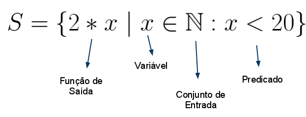

# <font color='blue'>**Compreensão de Lista (List Comprehension)**</font>

**Conteúdo adaptado do Prof. Marco André Lopes Mendes**

> Este material está dividido em quatro partes.

# Parte #1

# **O que é uma compreensão de lista?**


A compreensão de listas em Python é uma maneira concisa e expressiva de criar listas a partir de iteráveis (como listas, tuplas, ou objetos geradores) aplicando uma expressão a cada elemento e, opcionalmente, filtrando os elementos com base em uma condição. Ela permite que você crie listas de forma mais eficiente e legível em comparação com a abordagem tradicional de usar loops `for`.

A sintaxe básica da compreensão de listas é a seguinte:

```python
[nova_lista `for` elemento `in` iterável `if` condição]
```

Onde:

*   nova_lista: a lista resultante que você deseja criar.
*   elemento: a variável temporária que representa cada elemento do iterável.
*   iterável: a sequência de elementos que você deseja percorrer.
*   condição (opcional): uma expressão condicional que determina se um elemento deve ser incluído na lista resultante.


# **Notação matemática:**



# **Notação de compreensão de lista (Python)**

A expressão pode também ser lida como:

**S é um conjunto que contém como elementos os dobros de todos números naturais menores que 20.**

Ou ainda:

**Gere uma lista contendo o dobro de cada número inteiro na faixa de 0 a 19**


```python
# Notação em Python
S = [2 * x for x in range(0, 20)]
print(S)
```

# **Duas maneiras de converter Centígrados para Fahrenheit**


```python
# MANEIRA #1 (TRADICIONAL)
# converter Centígrados para Fahrenheit
ctemps = [0, 17.1, 22.3, 18.4, 19.1]
ftemps = []
for c in ctemps:
  f = c * 9/5 + 32
  ftemps.append(f)

print(ftemps)
```


```python
# MANEIRA #2 (list comprehension)
# converter Centígrados para Fahrenheit
ctemps = [0, 17.1, 22.3, 18.4, 19.1]
ftemps = [c * 9/5 + 32 for c in ctemps]

print(ftemps)
```

# **Compreensão de Lista que usa condições (com filtros)**

*Observe o trecho de código abaixo:*


```python
# maneira tradicional
S = []
for x in range(10):
  if x % 2 == 0:
    S.append(x*2)
print(S)
```

*O trecho acima poderia ser codificado com compreensão de lista, e obteria o mesmo resultado*


```python
# usando compreensão de lista (e filtro)
S = [x*2 for x in range(10) if x % 2 == 0]
print(S)
```

#### *Observe mais exemplos com filtros*


```python
# Gere uma lista contendo elementos x,
# sendo que x é um número entre 0 e 9,
# e x tem que ser um número impar
S = [x for x in range(10) if x % 2 != 0]
print(S)

# Gere uma lista contendo o dobro de todo elemento x,
# sendo x um número entre 0 e 9,
# e x tem que ser um número par
S = [x*2 for x in range(10) if x % 2 == 0]
print(S)

# mostre o número de elementos da lista S
S = len([x*2 for x in range(10) if x % 2 == 0])
print(S)
```

Muitas vezes você poderá desenvolver o código acima utilizando a estrutura `for` (forma tradicional).

Depois do código funcionando, você pode refatorá-lo (i.e. reescrê-lo), utilizando a compreensão de lista.

De forma geral, a compreensão de lista tem um desempenho melhor (mais rápida de ser criada) e deixa o código mais legível.

---

# **Compreensão de lista com conjuntos não numéricos**

Apesar de inspirada na notação matemática, essa construção também pode ser utilizada para conjuntos não-numéricos:


```python
print([nome.capitalize() for nome in ['guido', 'linus', 'mark']])
```

    ['Guido', 'Linus', 'Mark']


Detalhando:


```python
nomes = ['guido', 'linus', 'mark']
nomes_capitalizados = [nome.capitalize() for nome in nomes]
print(nomes_capitalizados)
```

# **Lista de Listas**

Também é possível gerar uma lista de listas como resultado:


```python
print([[s.capitalize(), s.upper(), len(s)] for s in ['guido', 'linus', 'mark']])
```

    [['Guido', 'GUIDO', 5], ['Linus', 'LINUS', 5], ['Mark', 'MARK', 4]]


No exemplo acima foi gerada uma lista de listas.

Cada lista foi gerada a partir de um dos nomes da lista original.

Os elementos gerados foram:


*   O nome com a primeira letra em maiúscula
*   O nome todo em caixa alta (maiúsculas)
*   A quantidade de caracteres do nome


# **Produto cartesiano**


**Definição Matemática:**

O produto cartesiano é um conceito fundamental em matemática que descreve uma operação entre conjuntos que resulta em um novo conjunto contendo todas as possíveis combinações ordenadas de elementos dos conjuntos originais. Esse conceito é chamado de "produto cartesiano" em homenagem ao matemático francês René Descartes, que contribuiu significativamente para o desenvolvimento da geometria analítica.

Formalmente, o produto cartesiano de dois conjuntos A e B, denotado como $A × B$, é definido da seguinte maneira:

$$A × B = {(a, b) \:|\: a ∈ A \;e\; b ∈ B}$$

Isso significa que o produto cartesiano $A × B$ é um conjunto de pares ordenados, onde o primeiro elemento do par pertence ao conjunto A e o segundo elemento pertence ao conjunto B. Cada combinação possível de elementos de A e B é incluída no produto cartesiano.

Por exemplo, se $A = {1, 2}$ e $B = {a, b}$, então o produto cartesiano $A × B$ será:

$$A × B = {(1, a), (1, b), (2, a), (2, b)}$$


```python
# Exemplo #1
# Defina os conjuntos A e B
A = [1, 2]
B = ['a', 'b']

# Calcule o produto cartesiano de A e B
produto_cartesiano = [(a, b) for a in A for b in B]

print(produto_cartesiano)

```


```python
# Exemplo 2
tipos = 'suco sorvete vitamina raspadinha'.split(' ')
frutas = 'abacaxi banana morango açaí uva'.split(' ')
cardapio = [(t,f) for t in tipos for f in frutas]

print(cardapio)
print('\nCardápio')
for tipo, fruta in cardapio:
  print(f"{tipo.capitalize()} de {fruta}")
```


```python
tipos = 'suco sorvete vitamina raspadinha'.split(' ')
tipos
```

# **Exercícios**


```python
# Criando uma lista de quadrados dos números de 1 a 5
quadrados = [x ** 2 for x in range(1, 6)]
print(quadrados)
```


```python
# Criando uma lista de palavras com mais de cinco letras a partir de uma lista de strings
palavras = ["gato", "cachorro", "rato", "elefante", "pássaro"]
mais_de_cinco_letras = [palavra for palavra in palavras if len(palavra) > 5]
print(mais_de_cinco_letras)
```


```python
# forma tradicional do trecho de código acima
palavras = ["gato", "cachorro", "rato", "elefante", "pássaro"]
mais_de_cinco_letras = []

for palavra in palavras:
  if len(palavra) > 5:
    mais_de_cinco_letras.append(palavra)

print(mais_de_cinco_letras)
```


```python
# converter "nome, sobrenome" para "sobrenome, nome"
nomes = ["Isaac Newton", "Albert Einstein", "Niels Bohr", "Marie Curie", "Charles Darwin", "Louis Pasteur", "Galileo Galilei", "Margaret Mead"]
split_nomes = [nome.split(" ") for nome in nomes]
sobrenome_primeiro = [sn[1] + ", " + sn[0] for sn in split_nomes]
print(sobrenome_primeiro)

# Bonus: somente sobrenomes
#sobrenomes = [split_nome[1] for split_nome in split_nomes]
#print(sobrenomes)
```


```python
# forma tradicional do trecho de código acima
nomes = ["Isaac Newton", "Albert Einstein", "Niels Bohr", "Marie Curie", "Charles Darwin", "Louis Pasteur", "Galileo Galilei", "Margaret Mead"]
result = []
for nome in nomes:
  split_nome = nome.split(" ")
  sobrenome_primeiro = split_nome[1] + ", " + split_nome[0]
  result.append(sobrenome_primeiro)

print(result)
```


```python
# cubos dos 10 primeiros números naturais
# forma tradicional
cubos = []
for x in range(10):
  cubos.append(x**3)

print(cubos)


# com compreensão de lista
cubos = [x**3 for x in range(10)]
print(cubos)

```


```python
# for com seleção condicional if
# forma tradicional
a = [2,3,4,5,6]
b = []

for elemento in a:
  x = elemento ** 3
  if x % 8 == 0:
    b.append(x)

print(b)
```


```python
# usando compreensão de lista
a = [2,3,4,5,6]
b = [elemento ** 3 for elemento in a if (elemento**3) % 8 == 0]

print(b)
```


```python
# for com seleção condicional composta if-else
a = [2,3,4,5,6]
b = []

for elemento in a:
  if elemento % 2 == 0:
    b.append(elemento ** 2)
  else:
    b.append(elemento ** 3)

print(b)
```


```python
# usando compreensão de lista
a = [2,3,4,5,6]
b = [elemento ** 2 if elemento % 2 == 0 else elemento ** 3 for elemento in a]

print(b)
```


```python
# múltiplos for
# criar uma lista chamada `list` com os elementos pares da matriz 3x3 chamada `mat`
mat = [[2,3,4],
       [7,9,10],
       [12,13,14]
      ]
list = []

for linha in mat:
  for elemento in linha:
    if elemento % 2 == 0:
      list.append(elemento)

print(list)
```


```python
# usando compreensão de lista
mat = [[2,3,4],
       [7,9,10],
       [12,13,14]
      ]

list = [elemento for linha in mat for elemento in linha if elemento % 2 == 0]

print(list)
```


```python
# Usando compreensão de listas, crie um baralho padrão, de 52 cartas
#naipes = 'Copas Ouros Espadas Paus'.split()
#cartas = 'A 2 3 4 5 6 7 8 9 10 J Q K'.split()

naipes = ['Copas', 'Ouros', 'Espadas', 'Paus']
cartas = ['A', '2', '3', '4', '5', '6', '7', '8', '9', '10', 'J', 'Q', 'K']

baralho = [(n,c) for n in naipes for c in cartas]

# imprime o baralho
print(baralho)
# imprime o número de cartas do baralho
print(len(baralho))

# pegando sete cartas do baralho
import random
random.sample(baralho,7)
```


```python
# Desafio
# Partindo do mesmo conjunto de cartas e naipes, crie um baralho de truco
```


```python
#@title Célula oculta

naipes = ['Copas', 'Ouros', 'Espadas', 'Paus']
cartas = ['4', '5', '6', '7', 'Q', 'J', 'K', 'A']

baralho_truco = [(valor, naipe) for naipe in naipes for valor in cartas]

for carta in baralho_truco:
  print(f"{carta[0]} de {carta[1]}")

```

# Referências

Para mais detalhes, acesse a documentação oficial:


[Compreensão de Listas](https://docs.python.org/3.10/tutorial/datastructures.html#list-comprehensions)

---

# Parte #2

# <font color='blue'>Compreensão de lista (list comprehension) #2</font>

# **Mais exemplos de uso de compreensão de lista**


```python
# Gera uma lista com o dobro de cada elemento da lista original
v = [-4, -2, 0, 2, 4]
v1 = [x*2 for x in v]
print(v1)
```


```python
# Gera uma lista com o quadrado de cada elemento da lista original,
# se elemento for positivo
v2 = [x for x in v if x >= 0]
print(v2)
v2 = [x**2 for x in v if x >= 0]
print(v2)
```


```python
# Gera uma lista com o valor absoluto (sem sinal) de cada elemento da lista original
v3 = [abs(x) for x in v]
print(v3)
```


```python
# Gera uma lista com os valores com 2 casas decimais
v4 = [-40.543, -2.76767, 0, 2.7765, 4.9877]
v5 = [round(x,2) for x in v4]
print(v5)
```


```python
# pi com várias formas de arredondamento
from math import pi
print([round(pi, casas) for casas in range(1, 6)])
```


```python
# Remove os "brancos" do início e fim de cada nome.
# Considera-se espaços, símbolos de tabulação e nova linha.
nomes = [' Guido', '  Linus \t ', 'Mark \n']
nomes_limpos = [nome.strip() for nome in nomes]
print("nomes limpos:", nomes_limpos)
```


```python
# Remove os "brancos" do início e fim de cada nome.
# Pega as 3 primeiras letras de cada nome e coloca a 1a em caixa alta.
nomes = [' guido', '  linus  ', 'mark ']
print("3 primeiros:", [nome.strip().capitalize()[:3] for nome in nomes])
```


```python
# Gera uma lista de pares (tuplas), contendo o elemento e seu quadrado.
print([(x,x**2) for x in range(6)])
```


```python
# É possivel também gerar um dicionário.
# Nesse caso, o elemento é a chave e seu quadrado é o valor correspondente.
print([{x:x**2} for x in range(6)])
```


```python
# Uma forma elegante de transformar uma lista com sublistas em uma lista única.
lista = [[1,2,3], [4,5,6], [7,8,9]]
print([numero for sublista in lista for numero in sublista])

# O mesmo exemplo, sem compreensão de listas:
l = []
for sublista in lista:
  for numero in sublista:
      l.append(numero)

print(l)

lista[0][-1]
```


# Referências

Para mais detalhes, acesse a documentação oficial:

[Compreensão de Listas](https://docs.python.org/3.10/tutorial/datastructures.html#list-comprehensions)

---

# Parte #3

# <font color='blue'>Compreensão de lista (list comprehension) #3</font>

# **Ainda mais exemplos de uso de compreensão de lista**


```python
# Gerando uma lista com cada caracter de um texto (string).
texto = "5 pães e 2 peixes."
print(list(texto))
caracteres = [x for x in texto]
print(caracteres)
```


```python
# Pegando apenas as letras e números (caracteres alfanuméricos).
caracteres = [caracter for caracter in texto if caracter.isalnum()]
print(caracteres)
```


```python
# Pegando apenas as letras (caracteres alfabéticos).
caracteres = [x for x in texto if x.isalpha()]
print(caracteres)
```


```python
# Pegando apenas as letras (caracteres alfabéticos) e criando uma nova string.
caracteres = ''.join([x for x in texto if x.isalpha()])
print(caracteres)
```


```python
# Pegando apenas os algarismos (caracteres numéricos).
números = [x for x in texto if x.isdigit()]
print(números)

# Convertendo os caracteres para inteiro.
números = [int(x) for x in texto if x.isdigit()]
print(números)
```


```python
# Ordenando os números (ordem ascendente).
números = sorted([int(x) for x in texto if x.isdigit()])
print(números)
```


```python
# Somando os elementos da lista.
soma_números = sum((int(x) for x in texto if x.isdigit()))
print(soma_números)
```


```python
# Pegando apenas as letras (caracteres alfabéticos) e criando uma nova string.
texto = """13Se eu falasse as línguas dos homens e dos anjos, mas não tivesse amor, seria como um sino que ressoa ou um címbalo que retine. 2Se eu tivesse o dom de profecias, se entendesse todos os mistérios de Deus e tivesse todo o conhecimento, e se tivesse uma fé que me permitisse mover montanhas, mas não tivesse amor, eu nada seria. 3Se desse tudo que tenho aos pobres e até entregasse meu corpo para ser queimado,55 e não tivesse amor, de nada me adiantaria."""
novo_texto = "".join([c for c in texto if not c.isdigit()])
print(texto)
print('\n\n')
print(novo_texto)
```

# Exercícios


```python
# Dada um número de telefone, mostre apenas os números, sem formatação.
telefone = '(47) 9 9999-4581'

# vai gerar: '47999994581'
#print(telefone_sem_formatacao)

```


```python
#@title Função oculta

# Dada um número de telefone, mostre apenas os números, sem formatação.
telefone = '(47) 9 9999-4581'

numeros = [digito for digito in telefone if digito.isdigit()]
numero_sem_formatacao = ''.join(numeros)
print(numero_sem_formatacao)

```

# Referências

Para mais detalhes, acesse a documentação oficial:

[Compreensão de Listas](https://docs.python.org/3.10/tutorial/datastructures.html#list-comprehensions)

---

# Parte #4

# <font color='blue'>Compreensão de lista (list comprehension) versus Expressão Geradora (Generator Expression)</font>

# **O que é uma Expressão Geradora (_Generator Expression_)?**

Em Python, um "*generator expression*" (expressão geradora) é uma maneira concisa de criar um objeto gerador.

Um objeto gerador é semelhante a uma lista, mas não armazena todos os valores em memória de uma vez. Em vez disso, ele gera valores sob demanda à medida que você itera sobre ele, economizando memória e sendo eficiente em termos de recursos.

A sintaxe de uma generator expression é semelhante à de uma _list comprehension_ (compreensão de lista), mas em vez de criar uma lista, ela cria um objeto gerador. A principal diferença é o uso de parênteses `()` em vez de colchetes `[]`. Aqui está um exemplo de uma *generator expression*:

```python
generator = (x for x in range(10))
```

No exemplo acima, estamos criando um gerador que gera os números de 0 a 9 quando iteramos sobre ele. Você pode iterar sobre o gerador usando um loop `for`, por exemplo:

```python
for num in generator:
    print(num)
```

Você também pode converter o gerador em uma lista usando a função `list()`:

`minha_lista = list(generator)`


---
---

### **Observações**

É importante observar que, ao contrário de uma lista, um gerador é esgotado depois que você itera sobre ele uma vez. Se você quiser iterar novamente sobre os mesmos valores, precisará criar um novo gerador.

Os geradores são úteis quando você precisa processar grandes conjuntos de dados que não caberiam facilmente na memória ou quando deseja evitar a criação de listas temporárias. Eles são especialmente úteis em situações onde a eficiência de memória é uma preocupação.


```python
import sys

#Criação:
l = [n*2 for n in range(1000)] # List comprehension
g = (n*2 for n in range(1000)) # Generator expression
print(l)
print(g)
```


```python
#Tipos de objetos:
print('Lista: ', type(l))  # <type 'list'>
print('Gerador:', type(g))  # <type 'generator'>
```


```python
#Uso de memória:
print('Tamanho da lista na memória: ', sys.getsizeof(l))
print('Tamanho do gerador na memória: ',sys.getsizeof(g))
```


```python
#Acesso a elementos individuais:
print('Acesso a elemento da lista: ', l[4])   # 8
try:
    print(g[4])   # TypeError: 'generator' object has no attribute '__getitem__'
except:
    print("Não é possível acessar um item diretamente de uma generator expression")
```

    Acesso a elemento da lista:  8
    Não é possível acessar um item diretamente de uma generator expression


```python
# Desempenho:
#List Comprehension:
import timeit
print('Tempo da lista: ', timeit.timeit('list_com = [i for i in range(100) if i % 2 == 0]', number=1000000))

#Generator Expression:
print('Tempo do gerador: ', timeit.timeit('gen_exp = (i for i in range(100) if i % 2 == 0)', number=1000000))
```

# Referências

Para mais detalhes, acesse a documentação oficial:

* [Compreensão de Listas/Expressão Geradora](https://docs.python.org/3.10/tutorial/datastructures.html#list-comprehensions)

* [Generators](https://wiki.python.org/moin/Generators)


