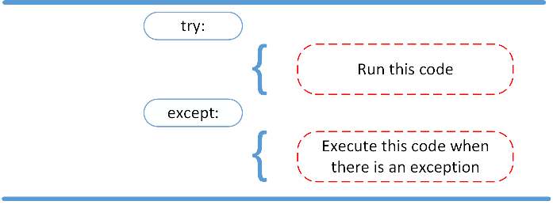
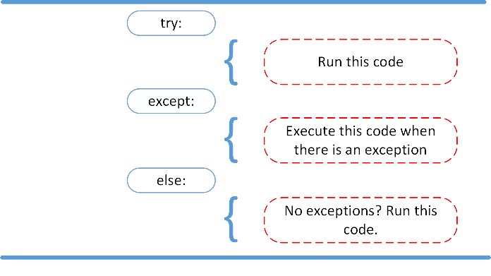
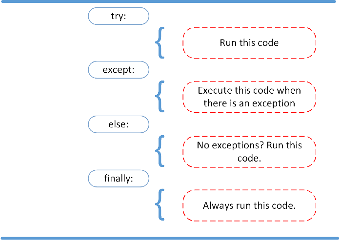
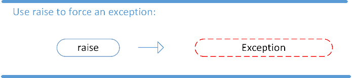
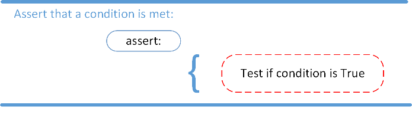

# <font color='blue'>**Tratamento de Erros e Exceções**</font>

### **Baseado nos materiais da Data Science Academy e Real Python**


```python
# Versão da Linguagem Python
!python --version
```

####  Um programa Python termina assim que encontra um erro. Ele pode ser um erro de **sintaxe** ou uma **exceção**

### **Mensagem de erros de sintaxe no Python**

Erros de sintaxe (_SintaxError_) ocorrem quando o analisador da linguagem, também chamado de _parser_ detecta uma instrução incorreta. Observe o exemplo abaixo:


```python
# Erro
print('Olá)
```


      File "<ipython-input-1-8a4956c51ec3>", line 2
        print('Olá)
              ^
    SyntaxError: unterminated string literal (detected at line 2)


Observe que existe uma "seta" a qual indica onde o _parser_ encontrou o **erro de sintaxe**.

Agora vamos criar uma função e executá-la com alguns dados para ver o que acontece.


```python
# Criando uma função
def numDiv (num1, num2):
  resultado = num1 / num2
  print(resultado)
```


```python
# Execução não gera erro
numDiv(4,2)
```


```python
# Execução gerando erro
numDiv(4,0)
```


    ---------------------------------------------------------------------------

    ZeroDivisionError                         Traceback (most recent call last)

    <ipython-input-5-b0b571bcf93d> in <module>
          1 # Execução gerando erro
    ----> 2 numDiv(4,0)
    

    <ipython-input-3-b4d5bff9dfcf> in numDiv(num1, num2)
          1 # Criando uma função
          2 def numDiv (num1, num2):
    ----> 3     resultado = num1 / num2
          4     print(resultado)


    ZeroDivisionError: division by zero


Desta vez, você encontrou um **erro de exceção**. Esse tipo ocorre sempre que o código Python está sintaticamente correto, porém resulta em um erro. A última linha da mensagem indicava que tipo de erro de exceção você encontrou:

```ZeroDivisionError: division by zero```


> Exceções são objetos especiais que Python usa para administrar erros que porventura surgirão durante a execução de um programa. Sempre que ocorre um erro e Python não sabe o que fazer a seguir, um objeto de exceção é criado. Se você escrever um código de tratamento de exceções, o programa continuará em execução. Se a exceção não for tratada, o programa irá parar e um _traceback_ (rastreamento) incluindo informações sobre a exceção levantada será exibido.


## **Try, Except, Finally: Tratamento de Exceções**



O bloco `try`/`except` é usado para capturar e tratar exceções. Python executa o código seguindo a instrução `try` como a parte “**normal**” do programa. O código que segue a instrução `except` é a resposta do programa a quaisquer exceções na cláusula `try` anterior.

### Observação importante:
**Ao usar blocos `try/except`, seus programas continuarão a executar, mesmo que algo comece a dar errado. Em vez de _tracebacks_, que podem ser confusos para os usuários lerem, os usuários verão mensagens de erro simpáticas escritas por você.**


```python
8 + 's'
```


    ---------------------------------------------------------------------------

    TypeError                                 Traceback (most recent call last)

    <ipython-input-2-963470595b1e> in <cell line: 1>()
    ----> 1 8 + 's'
    

    TypeError: unsupported operand type(s) for +: 'int' and 'str'


```python
# Utilizando try e except
try:
    8 + 's'
except TypeError:
    print("Operação não permitida")
```

### **A cláusula `else`**

#### Usando a instrução (ou cláusula) `else`, você pode instruir um programa a executar um determinado bloco de código apenas na ausência de exceções. Veja a figura abaixo.




```python
# Utilizando try, except e else
try:
    f = open('arquivos/testandoerros.txt','w')
    f.write('Gravando no arquivo')
except IOError:
    print ("Erro: arquivo não encontrado ou não pode ser salvo.")
else:
    print ("Conteúdo gravado com sucesso!")
    f.close()
```


```python
# Utilizando try, except e else
try:
    f = open('arquivos/testandoerros','r')
except IOError:
    print ("Erro: arquivo não encontrado ou não pode ser lido.")
else:
    print ("Conteúdo gravado com sucesso!")
    f.close()
```

###**A Cláusula `finally`**

Imagine que você sempre tivesse que implementar algum tipo de ação para limpar após executar seu código. Python permite que você faça isso usando a cláusula `finally`.




```python
try:
    f = open('arquivos/testandoerros.txt','w')
    f.write('Gravando no arquivo')
except IOError:
    print ("Erro: arquivo não encontrado ou não pode ser salvo.")
else:
    print ("Conteúdo gravado com sucesso!")
    f.close()
finally:
    print ("Comandos no bloco finally são sempre executados!")
```


```python
def askint():
  try:
      val = int((input("Digite um número: ")))
  except UnboundLocalError:
      print ("Você não digitou um número!")
  finally:
      print ("Obrigado!")
      print (val)
```


```python
askint()
```


```python
def askint():
  try:
      val = int(input("Digite um número: "))
  except:
      print ("Você não digitou um número!")
      val = int(input("Tente novamente. Digite um número: "))
  finally:
      print ("Obrigado!")
  print (val)
```


```python
askint()
```


```python
def askint():
  while True:
      try:
          val = int(input("Digite um número: "))
      except:
          print ("Você não digitou um número!")
          continue
      else:
          print ("Obrigado por digitar um número!")
          break
      finally:
          print("Fim da execução!")
      print (val)
```


```python
askint()
```


```python
tuple = (1,2,3,4,5)
try:
    tuple.append(6)
    for each in tuple:
        print(each)
except AttributeError as e:
    print('Erro: ', e)
except IOError as e:
    print('Erro de I/O:', e)
```

## **Gerando (_raising_) uma Exceção**

Podemos usar o comando `raise` para lançar uma exceção se ocorrer uma condição. A instrução pode ser complementada com uma exceção personalizada.



Se você quiser lançar um erro quando uma determinada condição ocorrer usando `raise`, você poderia fazer assim:


```python
x = 10
if x > 5:
  raise Exception(f'x não pode exceder o valor 5. O valor de x era: {x}')
```

> O programa para e exibe nossa exceção na tela, oferecendo pistas sobre o que deu errado.

## **A Exceção `AssertionError`**

Em vez de esperar que um programa trave no meio do caminho, você também pode começar fazendo uma *afirmação* em Python. Afirmamos que uma certa condição é atendida. Se esta condição for `True`, então isso é excelente! O programa pode continuar. Se a condição for `False`, você poderá fazer com que o programa lance uma exceção `AssertionError`.



Observe alguns exemplos do comando `assert`


```python
# verificação de précondições
def divide(a, b):
  assert b != 0, "O divisor não pode ser zero"
  return a / b

result = divide(10, 2)  # Isso funciona bem
result = divide(10, 0)  # Isso levanta um AssertionError

```

> Neste exemplo, usamos o `assert` para verificar se o divisor não é zero antes de realizar a divisão. Se a condição **não** for atendida, um `AssertionError` é levantado com a mensagem personalizada.


```python
# teste unitários
def add(a, b):
  return a + b

def test_add():
  assert add(2, 3) == 5, "A função add() não está funcionando corretamente"
  assert add(0, 0) == 0, "A função add() não está funcionando corretamente"
  assert add(-1, 1) == 0, "A função add() não está funcionando corretamente"

test_add()

```

> Se uma das asserções falhar, o teste levantará um `AssertionError` com a mensagem associada.


```python
# depuração de código
def calculate_square_root(x):
  assert x >= 0, "Não é possível calcular a raiz quadrada de um número negativo"
  return x ** 0.5

result = calculate_square_root(-4)  # Isso levanta um AssertionError durante a depuração

```

> Usamos `assert` para verificar se o número passado para a função `calculate_square_root()` é positivo. Se não for, um `AssertionError` é levantado para indicar que há um problema em algum lugar do código.

**A tabela abaixo resume o que vimos sobre `try/except, else e finally`**

| Cláusula      | Descrição |
| ----------- | ----------- |
| `try`      | todas as instruções são executadas até que uma exceção seja encontrada.|
| `except`   | usada para capturar e tratar as exceções encontradas na cláusula `try`|
| `else`      | permite codificar seções que devem ser executadas somente quando nenhuma exceção for encontrada na cláusula `try` |
| `finally`      | permite executar seções de código que sempre devem ser executadas, com ou sem exceções encontradas anteriormente. |
| `raise`    | permite que você lance uma exceção a qualquer momento. |
| `assert` | permite verificar se uma determinada condição foi atendida e lançar uma exceção se não for. |


### **Para resumir:**

*   **Erros**
  * Representam condições como erro de compilação, erro de sintaxe, erro na parte lógica do código, incompatibilidade de biblioteca, recursão infinita, etc.

  * Geralmente estão além do controle do programador e não devemos tentar lidar com eles.

*   **Exceções**

  * Podem ser capturadas e tratadas pelo programa.

---

Uma lista completa de exceções em Python, pode ser encontrada aqui:


[Exceções em Python](https://docs.python.org/pt-br/3.11/library/exceptions.html)